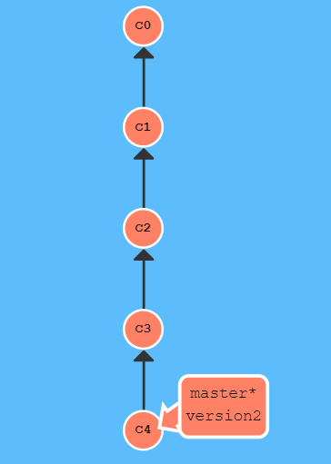

# hello git
## git 명령어 요약
- clone: 원격 저장소 내 컴퓨터에 복사
- add: 커밋하기 전 작업들을 묶어서 스테이지 영역에 넣기(폴더 만들기라 생각하면 좋을듯)
- commit: 세이브, 스테이지 영역의 파일들을 가지고 커밋(세이브)를 만들 수 있다.(내 컴퓨터에 세이브 포인트 저장이라 생각하면 좋을듯)
- push: 원격 저장소에 커밋을 업로드한다.
- 코드 뭉치 버리기: 마지막 커밋으로 되돌리기

## 브랜치 변경하기
- 브랜치: 기존 내용을 유지한 체 새로운 내용을 추가하고 싶을 때 사용한다.
- 체크아웃: 특정 브랜치 (혹은 커밋)으로 돌아가고 싶을 때 사용.
- 소스트리의 체크아웃: 브랜치 이름을 더블 클릭하는 것만으로 체크아웃 가능

## 병합하기 1
- 헤드 브랜치에 변경사항이 없고
- 병합 대상 브랜치가 헤드로부터 시작된 경우
- 아주 쉽게 병합 가능 = Fast-forward

## 병합하기 2
- 헤드 브랜치에 추가적인 커밋이 생기는 경우
- 진짜 병합이 필요해 진다.
- 충돌이 안 나면 좋은데, 충돌이 나도 겁내지 말자.

## 병합해서 충돌이 안 나려면?
- 다른 파일에서 작업을 하면 충돌이 안 난다.

## 병합 충돌 해결 방법
1. 에디터를 이용한 충돌 해결
2. 충돌난 파일 우클릭으로 하나의 브랜치를 살리고 나머지는 버리는 방법

## 풀(pull)
- 로컬에 있는 것보다 원격(깃허브)에 있는게 더 최신이여서 원격에 있는 버전을 로컬로 가져온다.

## 커밋 되돌리기기
###  reset
- 장점: 쉽다
- 단점1: 하지만 커밋이 지워진다.
- 단점2: 강제 푸시가가 필요하다
  > 이럴때는 병합을 하고 충돌을 해결한 다음 푸쉬를 하면 해결

### branch 만들어서 되돌리기
- 장점1: 쉽다.
- 장점2: reset과는 달리 내용이 사라지지 않는다
- 단점: 트리가 지저분해진다.

### revert를 이용해서 되돌리기
